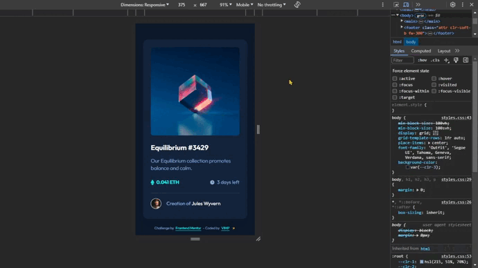
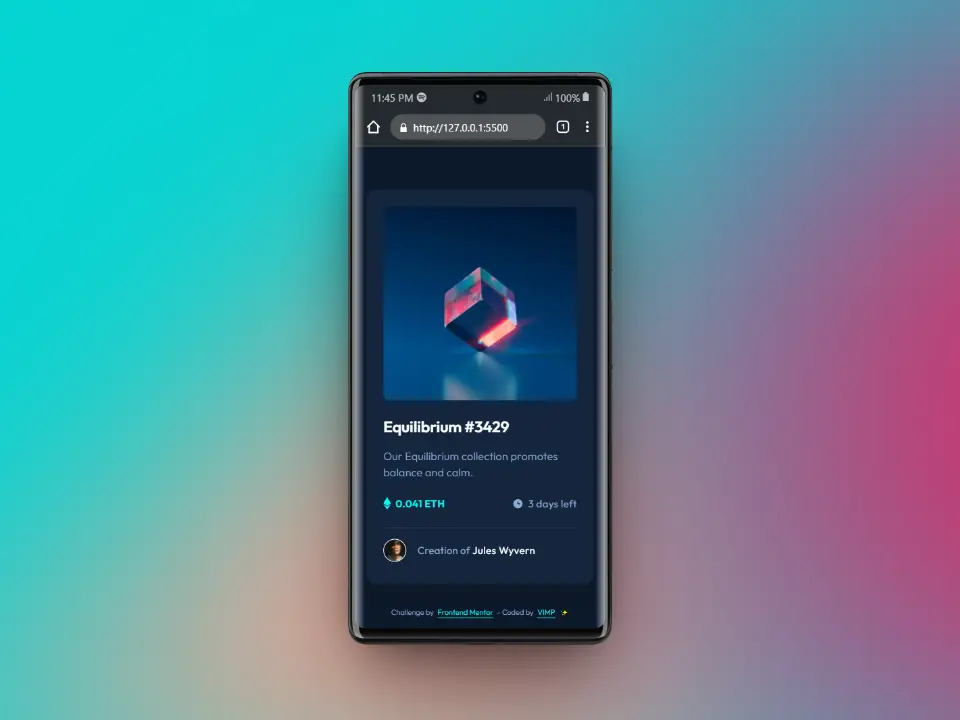
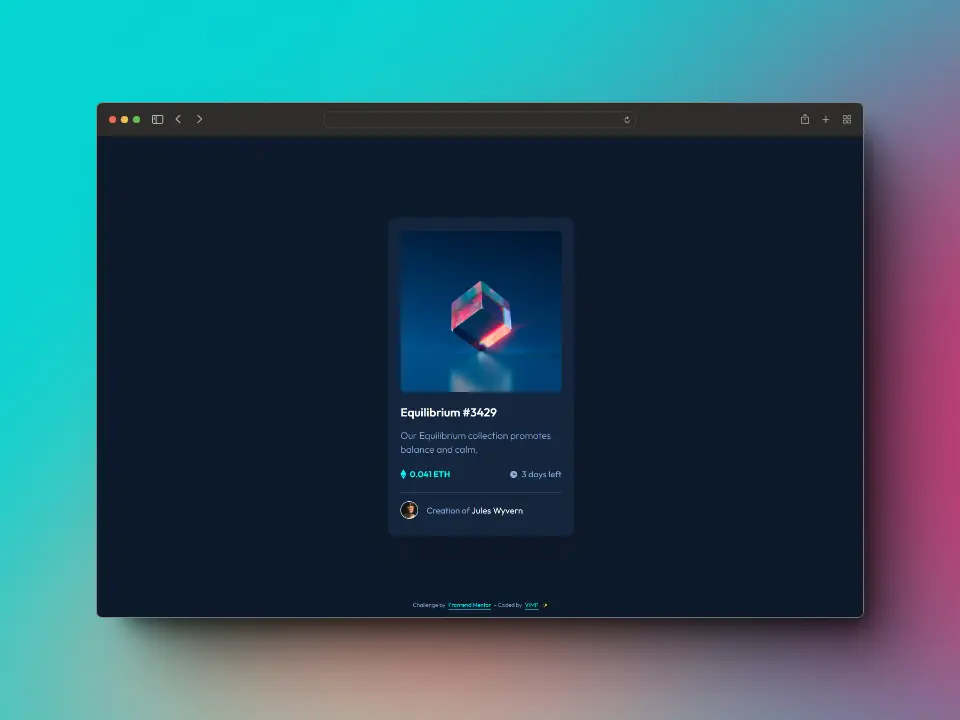

# Frontend Mentor - NFT preview card component solution

This is a solution to the [NFT preview card component challenge on Frontend Mentor](https://www.frontendmentor.io/challenges/nft-preview-card-component-SbdUL_w0U).

Frontend Mentor challenges help you improve your coding skills by building realistic projects.

## Table of contents

- [The challenge](#the-challenge)
- [Screenshot](#screenshot)
- [Links](#links)
- [Built with](#built-with)
- [Author](#author)

## The challenge

Users should be able to:

📌 View the optimal layout depending on their device's screen size

📌 See hover states for interactive elements

## Screenshot

### 📱 Mobile

### 💻 Desktop

## Links

[Live](https://mendez-v.github.io/nft-preview-card/) 👀

<!-- [Frontend Mentor](https://your-live-site-url.com) 👀 -->

## Built with

🎯 Semantic HTML5 markup

🎯 Mobile-first workflow

🎯 CSS custom properties

🎯 Utility classes

🎯 Flexbox

🎯 CSS Grid

## Author

- Frontend Mentor - [@mendez-v](https://www.frontendmentor.io/profile/mendez-v)
